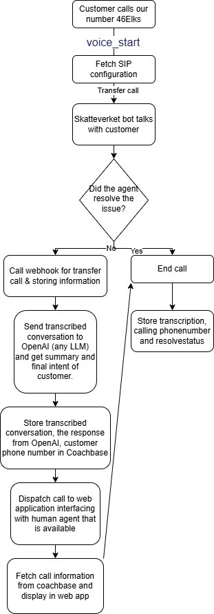

# AI Voicebot for Skatteverket Customer Support

## Overview
Skatteverket's customer support currently experiences long queue times for phone inquiries, particularly affecting elderly individuals, people with disabilities, and those seeking quick answers. The existing process involves slow, manual options for identifying user intent and routing calls to the appropriate department, leading to frustration.

## Proposed Solution
Implement a multilingual AI Voicebot as the first line of support for Skatteverket's phone-based customer service. The Voicebot will streamline interactions, reduce wait times, and address language barriers.

## Key Features
- **Multilingual Support:** Communicates fluently in multiple languages to accommodate diverse callers, ensuring accessibility for non-Swedish speakers.
- **Domain-Specific Knowledge:** Trained with comprehensive knowledge of Skatteverket's processes, policies, and common inquiries (e.g., tax declarations, refunds, or registration), enabling accurate and relevant responses.
- **Intent Recognition:** Uses natural language processing to quickly identify the user's intent through conversational prompts, minimizing delays caused by traditional menu-based systems.
- **Query Resolution:** Provides immediate answers for common or straightforward inquiries, reducing the need for human intervention.
- **Seamless Handoff:** If the Voicebot cannot resolve a query, it forwards the call to a human agent, providing:
  - A transcribed record of the conversation.
  - A summary of the interaction.
  - The user's final intent, ensuring a smooth transition and faster resolution.
- **Accessibility Focus:** Prioritizes ease of use for elderly callers and those with disabilities, with clear voice prompts and simple interaction flows.

## Benefits
- **Reduced Wait Times:** Handles routine inquiries and routes complex issues efficiently, significantly decreasing queue times.
- **Improved Accessibility:** Multilingual capabilities and user-friendly design make the service more inclusive for all demographics.
- **Enhanced Efficiency:** Human agents receive pre-processed information, allowing them to focus on complex cases rather than repetitive tasks.
- **Cost Savings:** Automating first-line support reduces the workload on human staff, optimizing resource allocation.

## Implementation Considerations
- **Training Data:** The Voicebot must be trained on Skatteverket-specific datasets, including FAQs, tax regulations, and common customer scenarios.
- **Language Models:** Incorporate advanced NLP models to support multiple languages and dialects, with regular updates to maintain accuracy.
- **Privacy Compliance:** Ensure compliance with GDPR and other data protection regulations, particularly for call transcription and data sharing.
- **User Testing:** Conduct trials with diverse user groups (e.g., elderly, non-native speakers) to refine the Voicebot's usability and effectiveness.
- **Fallback Mechanism:** Design a robust handoff process to ensure no caller is left unresolved due to system limitations.

## Tech Stack
- **ElevenLabs:** For Voice-to-Voice agent capabilities.
- **Twilio:** For receiving and managing phone calls, and integration with ElevenLabs.
- **React:** For the human agent interface.
- **RAG (Retrieval-Augmented Generation):** For answering questions with public information from Skatteverket sites.

For more information on the ElevenLabs and Twilio integration, see the [official documentation](https://elevenlabs.io/docs/conversational-ai/guides/twilio/native-integration).

## Usage Flow
1. **User calls the Skatteverket support phone number.**
2. **Voicebot answers the call** and interacts with the user, answering questions using public information from Skatteverket sites via RAG.
3. **If the Voicebot cannot help,** the call is forwarded to a human agent.
4. **Human agent receives:**
   - The transcribed conversation
   - A summary of the interaction
   - The user's final intent
   - The agent interacts with the customer via a React application interface (with possible Twilio integration).

### System Flow Diagram

## Conclusion
The AI Voicebot for Skatteverket will modernize customer support by providing a fast, multilingual, and accessible first line of assistance. By resolving simple queries and efficiently routing complex ones, it will reduce wait times, break down language barriers, and enhance the overall user experience. 

# Original template README:

> # Cillers System Demo Template For Kong AI Gateway Hackathon at AWS Sweden HQ, April 23, 2025
> \
> Documentation: https://docs.cillers.com/cillers-system-demo-templates/kong-ai-+-gateway-hackathon
> \
> Author: André Eriksson and Peder Linder